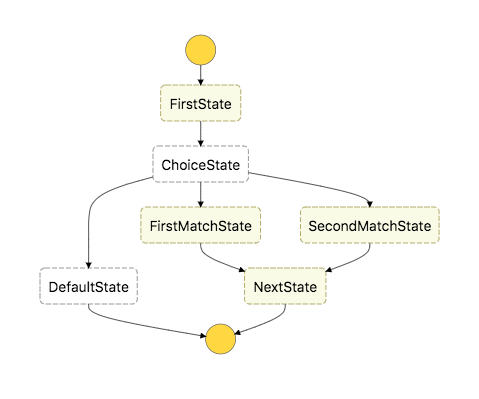

# States Language on Cadence

This is an implementation of [States Language](https://states-language.net/spec.html) on top of the [Cadence Workflow](https://cadenceworkflow.io/) engine.

#### Project Status

:warning: **Note: This project is not production ready!** :warning:

This project is still under development and isn't ready for use in production. Feedback is welcome from the Cadence community. The goal is to provide a plugable way to execute State Language workflows on top of Cadence.

There a few States Language features still missing:
- [ ] Error handling
- [ ] Retry logic
- [ ] JSON paths
- [ ] Map task type


#### About States Language

Amazon States Language (ASL) is a JSON specification describing state machines and workflows. It is the description that powers AWS Step Functions. Cadence is a robust workflow engine created and open sourced by Uber.
This project allows you to mimic Step Functions outside of AWS infrastructure on inside a Cadence workflow.

- [Spec](./STATE_SPEC.md)
- [Website](https://states-language.net/spec.html)
- [Editor](https://github.com/checkr/states-language-editor)

#### Running tests

```
make test
```

#### Updating vendors

```
make mod-vendor
```

#### Example

An example command is provided in `cmd/workflow`. It should demenstrate how to use the framework and register workflows.

#### What is States Language?

The operation of a state machine is specified by states, which are represented by JSON objects, fields in the top-level
 `"States"` object. In this example, there is one state named `"FirstState"`.

When this state machine is launched, the interpreter begins execution by identifying the Start State (`"StartAt"`). It 
executes that state, and then checks to see if the state is marked as an End State. If it is, the machine terminates 
and returns a result. If the state is not an End State, the interpreter looks for a `"Next"` field to determine what 
state to run next; it repeats this process until it reaches a Terminal State (Succeed, Fail, or an End State) or a 
runtime error occurs.



```json
{
  "Comment": "An example of the Amazon States Language using a choice state.",
  "StartAt": "FirstState",
  "States": {
    "FirstState": {
      "Type": "Task",
      "Resource": "arn:aws:lambda:REGION:ACCOUNT_ID:function:FUNCTION_NAME",
      "Next": "ChoiceState"
    },
    "ChoiceState": {
      "Type": "Choice",
      "Choices": [
        {
          "Variable": "$.foo",
          "NumericEquals": 1,
          "Next": "FirstMatchState"
        },
        {
          "Variable": "$.foo",
          "NumericEquals": 2,
          "Next": "SecondMatchState"
        }
      ],
      "Default": "DefaultState"
    },
    "FirstMatchState": {
      "Type": "Task",
      "Resource": "arn:aws:lambda:REGION:ACCOUNT_ID:function:OnFirstMatch",
      "Next": "NextState"
    },
    "SecondMatchState": {
      "Type": "Task",
      "Resource": "arn:aws:lambda:REGION:ACCOUNT_ID:function:OnSecondMatch",
      "Next": "NextState"
    },
    "DefaultState": {
      "Type": "Fail",
      "Error": "DefaultStateError",
      "Cause": "No Matches!"
    },
    "NextState": {
      "Type": "Task",
      "Resource": "arn:aws:lambda:REGION:ACCOUNT_ID:function:FUNCTION_NAME",
      "End": true
    }
  }
}
```
